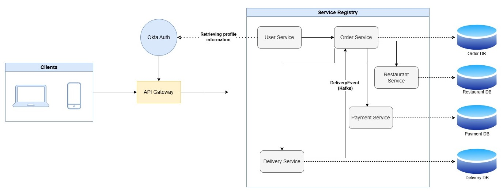

# Microservices Food Delivery App

This project is a **microservices-based food delivery application** built using **Spring Boot** and **Spring Cloud** technologies. The application is containerized using **Docker** and leverages **Okta** for authentication and user registration. It employs asynchronous communication through **Kafka** and uses **Junit4** for unit and integration tests.

## Diagram



> The above diagram illustrates the architecture of the microservices ecosystem, including the service registry, API gateway, Okta authentication, individual services, Kafka for asynchronous communication, and the databases for each service.

## Microservices Overview

### 1. **Service Registry (Eureka Server)**

- **Technology**: Spring Cloud Eureka
- **Purpose**: Acts as the service registry where all microservices register themselves for discovery.
- **Docker Container**: `eureka-server`
- **Port**: `8761`
- **Communication**: Other microservices communicate with Eureka to discover each other for seamless integration.

### 2. **API Gateway**

- **Technology**: Spring Cloud Gateway
- **Purpose**: The API gateway acts as the entry point for all client requests and routes the requests to the appropriate microservices. It integrates with **Okta** for authentication. It authenticates requests and propagates the authentication context down the pipeline for other services.
- **Docker Container**: `api-gateway`
- **Port**: `9090`
- **Dependencies**:
  - Eureka Server
  - Redis (utilized for load-balancing: 1 request per 1 user per second)
- **Environment Variables**:
  - `SPRING_OKTA_CLIENT_ID`
  - `SPRING_OKTA_CLIENT_SECRET`
  - `EUREKA_SERVER_ADDRESS`
    
### 3. **Restaurant Service**

- **Technology**: Spring Boot
- **Purpose**: Manages restaurants and dishes. It contains authorized endpoints for getting restaurant and dish data, updating and deleting restaurants, adding dishes to restaurants and updating dishes in restaurants.
- **Docker Container**: `restaurant-service`
- **Port**: `8081`
- **Dependencies**:
  - Eureka Server
- **Environment Variables**:
  - `DB_HOST`
  - `SPRING_DATASOURCE_PASSWORD`
  - `EUREKA_SERVER_ADDRESS`
- **Database**: MS SQL database hosted in a Docker container (container name: `restaurant-db`).

### 4. **User Service**

- **Technology**: Spring Boot
- **Purpose**: Communicates with **Okta** to retrieve currently logged in user's profile information.
- **Docker Container**: `user-service`
- **Port**: `8085`
- **Dependencies**:
  - Eureka Server
- **Environment Variables**:
  - `SPRING_OKTA_CLIENT_ID`
  - `SPRING_OKTA_CLIENT_SECRET`
  - `EUREKA_SERVER_ADDRESS`

### 5. **Payment Service**

- **Technology**: Spring Boot
- **Purpose**: Handles payment processing and payment transactions. Contains authorized endpoints for saving transaction details and retrieving transaction details. This service is called internally by Order service and it can't be used as a standalone.
- **Docker Container**: `payment-service`
- **Port**: `8083`
- **Dependencies**:
  - Eureka Server
  - Payment DB (`payment-db`)
- **Environment Variables**:
  - `DB_HOST`
  - `SPRING_DATASOURCE_PASSWORD`
  - `EUREKA_SERVER_ADDRESS`
- **Database**: MS SQL database hosted in a Docker container (container name: `payment-db`).

### 6. **Delivery Service**

- **Technology**: Spring Boot
- **Purpose**: Manages delivery orders and tracks delivery statuses. Contains authorized endpoints for creating new delivery records and retrieving delivery details. This service is called internally by Order service and it can't be used as a standalone. It also utilizes Kafka for dispatching an asynchronous event (delivery-topic).
- **Docker Container**: `delivery-service`
- **Port**: `8084`
- **Dependencies**:
  - Eureka Server
  - Kafka (for async communication)
  - Delivery DB (`delivery-db`)
- **Environment Variables**:
  - `DB_HOST`
  - `SPRING_DATASOURCE_PASSWORD`
  - `EUREKA_SERVER_ADDRESS`
- **Database**: MS SQL database hosted in a Docker container (container name: `delivery-db`).
- **Asynchronous Communication**:
  - Uses **Kafka** to communicate with the **Order Service** for async order updates.

### 7. **Order Service**

- **Technology**: Spring Boot
- **Purpose**: Manages customer orders. It contains authorized endpoints for order management. This is a central microservice that communicates with other services. It checks the availibility of the dish in a restaurant (Restaurant service), it initiates the payment process (Payment service) and if the payment is successful, it initiates the delivery process (Delivery service).
- **Docker Container**: `order-service`
- **Port**: `8082`
- **Dependencies**:
  - Eureka Server
  - Kafka (for async communication)
  - Delivery Service
  - Payment Service
  - Restaurant Service
  - Order DB (`order-db`)
- **Environment Variables**:
  - `DB_HOST`
  - `SPRING_DATASOURCE_PASSWORD`
  - `SPRING_OKTA_CLIENT_ID`
  - `SPRING_OKTA_CLIENT_SECRET`
  - `EUREKA_SERVER_ADDRESS`
- **Asynchronous Communication**:
  - Uses **Kafka** to communicate with the **Delivery Service** for updating order status.

## Asynchronous Communication Using Kafka

- **Kafka Setup**: The **Delivery Service** and **Order Service** communicate asynchronously using **Apache Kafka**. Kafka enables real-time, event-driven communication between microservices, which allows decoupling of services.
- **Kafka Topics**:
  - `delivery-topic`: Used for order status updates in Order service once the delivery in Delivery service is completed.

## Testing with JUnit4, Mockito, and WireMock

- **JUnit4**: Used for writing unit and integration tests to ensure the correctness of individual microservices.
- **Mockito**: A mocking framework used in unit tests to simulate service behavior and dependencies.
- **WireMock**: Used to simulate external APIs for testing integration and communication between services.

## Docker Containers

Each microservice contains a *Dockerfile* and is packaged as a **Docker container**. Additionally, the following services are also containerized:

- **Redis**: Used for load-balancing.
- **Kafka**: For event-driven communication between services.
- **Zookeeper**: Required for Kafka's coordination and management.
- **MS SQL Databases**: Each microservice (restaurant, order, payment and delivery) has its own database container.

Additionally, there is a `docker-compose.yml` file at the root of the project which is used  to configure and run all the services, including microservices, Kafka, Redis, and the database containers.
**Command**: 
   ```bash
   docker-compose up --build
   ```
**Important**: It should be noted that some environment varibales in the docker-compose file represent my own database and okta credentials which are pulled from system's local environment for security reasons. Therefore, to test this project, you should set up your own version of those variables in your local environment.

